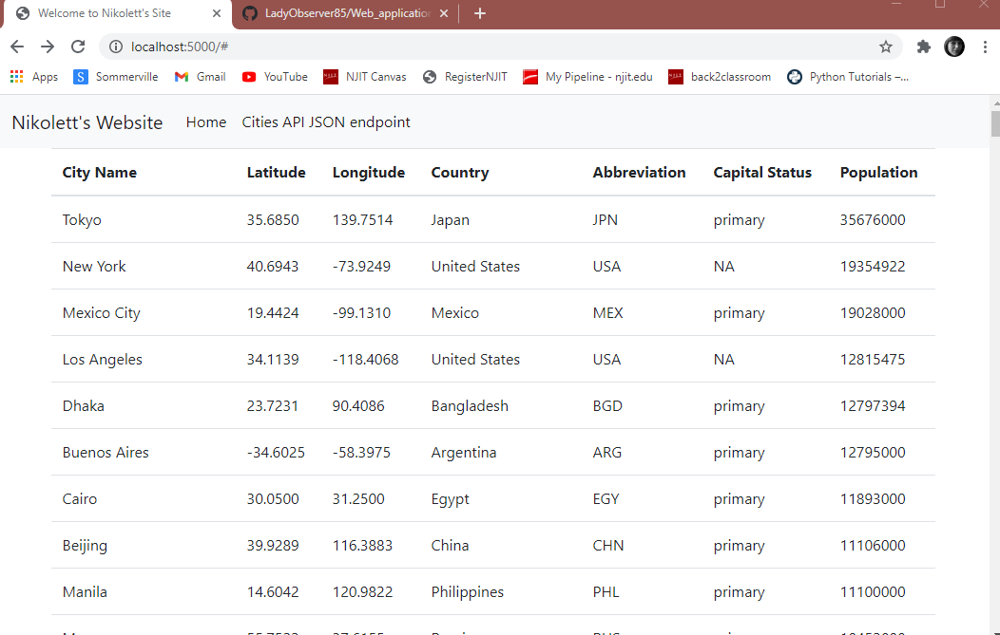

# Project Description
## Part 1

This project is a homework assignment to teach how to get Pycharm setup with Docker, Flask, MySQL, and Postman.

[View Assignment Video Here](https://youtu.be/QbMWNgrfAFg)

## Part 2

For this assignment, your goal is setup a Bootstrap HTML template using Flask Templates and
use it to display data retrieved from your database.

[View Assignment Video Here](https://www.youtube.com/watch?v=tylzleJDlkc&ab_channel=KeithWilliams)

## Part 3

In this project you will need to create HTML forms to create new records, update records, and a small form that
has no fields other than a submit button to delete records.

[View Assignment Video Here](https://www.youtube.com/watch?v=5WBYxNZz8Zw&ab_channel=KeithWilliams)

# Postman Screenshot

# SQL Data Screenshot

# Website Screenshot
