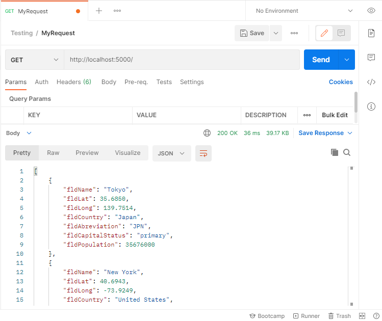
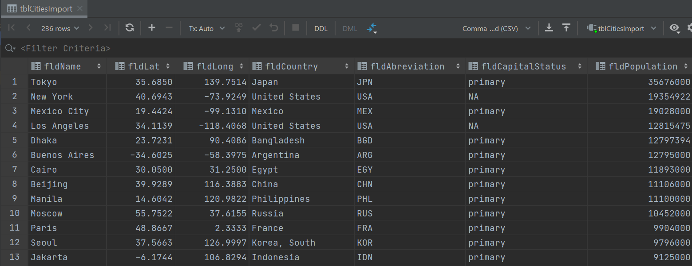

# Project Description
This project is a homework assignment to teach how to get Pycharm setup with Docker, Flask, MySQL, and Postman.

[View Assignment Video Here](https://youtu.be/QbMWNgrfAFg)

# Postman Screenshot

# SQL Data Screenshot

